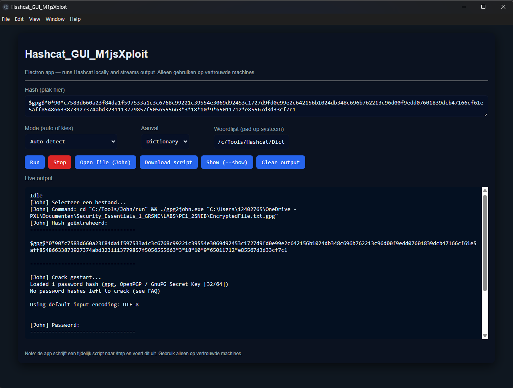

# Hashcat GUI

### Graphical Hashcat & John the Ripper Interface

A lightweight **GUI wrapper for Hashcat and John the Ripper**, designed to simplify password cracking workflows during security labs and penetration testing exercises.

This tool focuses on **ease of use**, **clear output**, and **automation of common cracking tasks**, while still giving full control over Hashcat and John parameters.

No API keys, no cloud services — everything runs locally.

<br>
<div align="center">
  <a href="https://raw.githubusercontent.com/MijsBjornPXL/HashCat_GUI/main/Screens/GUI_1.png" target="_blank" rel="noopener noreferrer">
    
  </a>
  <a href="https://raw.githubusercontent.com/MijsBjornPXL/HashCat_GUI/main/Screens/GUI_2.png" target="_blank" rel="noopener noreferrer">
    
  </a>
</div>
<br>

## Features

- GUI-based execution of **Hashcat**
- Integrated **John the Ripper**
- Automatic hash extraction using:
  - `pdf2john`
  - `office2john`
  - `zip2john`
  - `rar2john`
  - `gpg2john`
    
- Supports common file types:
  - `PDF`
  - `ZIP`
  - `RAR`
  - `Office documents (DOCX, XLSX, PPTX)`
  - `GPG encrypted files`
    
- Wordlist-based cracking
- Automatic detection of hash formats
- Live output streaming in the GUI
- Start / Stop functionality
- Clean and readable console-style output
- Built for **educational and lab environments**

---

## Requirements

- **Operating System**
  - Windows (primary target)
  - Linux (experimental)

- **Installed Tools**
  - Hashcat
  - John the Ripper (Jumbo recommended)
  - Git Bash (Windows)

- **Runtime**
  - Node.js (LTS recommended)

---

## Prerequisites

Before using **HashCat_GUI**, ensure the following tools and dependencies are installed and correctly configured on your system.

### Operating System
- Windows 10 or Windows 11 (64-bit recommended)

### Hashcat
- Hashcat must be installed on the system.
- The `hashcat.exe` binary must be accessible either:
  - via the system **PATH**, or
  - via an absolute path configured inside the application.

Recommended installation directory:

```bash
C:\Tools\hashcat\
```

### John the Ripper

- John the Ripper (Jumbo version) is required for cracking ZIP, RAR, and other archive-based hashes.
- The john.exe binary must be accessible either:
  - via the system PATH, or
  - via an absolute path configured inside the application.

Recommended installation directory:

```bash
C:\Tools\john\run\
```

### Node.js & electron

- Node.js (LTS version) is required.
- Electron is required to run the GUI.

Install Electron globally:

```bash
npm install -g electron
```

## Environment Variables (Recommended)

```makefile
C:\Tools\hashcat
C:\Tools\john\run
```

This allows the GUI to invoke hashcat and john without requiring hardcoded paths.

## Installation

```bash
git clone https://github.com/MijsBjornPXL/HashCat_GUI.git
cd HashCat_GUI
```

```powershell
.\Hashcat_GUI_M1jsXploit.ps1
```

---

## Disclaimer

This tool is intended **for educational use only**.

---

## License

MIT License
